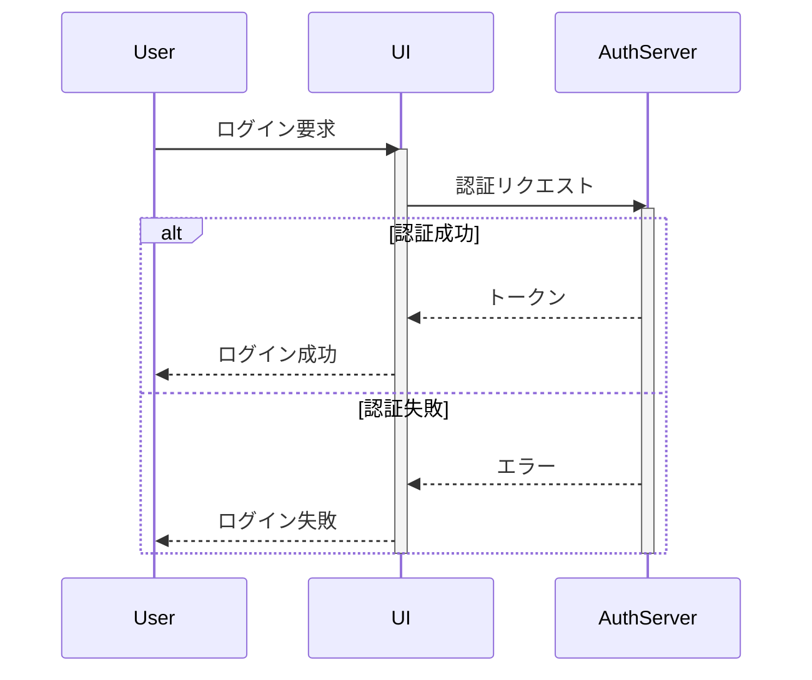

# NextDesign Mermaid Converter

NextDesignのシーケンス図とMermaid形式テキストの完全な双方向変換を実現するエクステンションです。

## 🎯 機能

### エクスポート機能
- NextDesignのシーケンス図をMermaid形式(.mmd)にエクスポート
- ライフライン、メッセージ、フラグメント、アクティベーション、ノートをサポート
- NextDesign固有情報をメタデータファイル(.meta.json)として保存

### インポート機能
- Mermaid形式ファイルをNextDesignのシーケンス図としてインポート
- メタデータファイルがあればID・順序を完全復元
- メタデータなしでも新規作成可能

### サポート要素

#### 基本要素
- ライフライン (participant/actor)
- 同期メッセージ (`->>`)
- 非同期メッセージ (`--)`)
- 応答メッセージ (`-->>`)
- Create/Destroyメッセージ

#### 高度な要素
- 複合フラグメント (alt/opt/loop/par)
- ネストフラグメント (最大5レベル)
- アクティベーション (`+`/`-`)
- ノート (`Note left of`/`Note right of`/`Note over`)

## 📦 インストール

1. 本リポジトリをダウンロードまたはクローン
2. `src`フォルダをNextDesignの拡張機能フォルダにコピー
   - 通常: `%USERPROFILE%\Documents\NextDesign\Extensions\`
3. NextDesignを再起動
4. リボンタブに「Mermaid変換」が表示されることを確認

## 🚀 使用方法

### エクスポート

1. NextDesignでシーケンス図を選択
2. リボンタブ「Mermaid変換」→「Mermaidへエクスポート」ボタンをクリック
3. 保存先とファイル名を指定
4. 以下のファイルが生成されます:
   - `{name}.mmd` - Mermaid形式のシーケンス図
   - `{name}.meta.json` - NextDesign固有情報のメタデータ

### インポート

1. NextDesignでプロジェクトを開く
2. リボンタブ「Mermaid変換」→「Mermaidからインポート」ボタンをクリック
3. `.mmd`ファイルを選択
4. 同じフォルダに`.meta.json`があれば自動的に読み込まれます
5. シーケンス図がNextDesignに作成されます

## 📝 Mermaid構文例



## 📚 ドキュメント

- [ユーザーガイド](docs/user-guide.md) - 詳細な使用方法
- [開発者ガイド](docs/developer-guide.md) - アーキテクチャと拡張方法
- [ファイル形式仕様](docs/file-format.md) - メタデータJSON仕様
- [トラブルシューティング](docs/troubleshooting.md) - よくある問題と解決方法

## 🔧 技術仕様

- **対応バージョン**: Next Design 3.0以降
- **言語**: C#スクリプト
- **フレームワーク**: Next Design Extension API
- **メタデータ形式**: JSON

### 必要なライブラリ

コードは以下の.NETライブラリを使用します:

- `System.*` - 基本ライブラリ (常に利用可能)
- `System.Text.Json` - JSON処理 (.NET Core 3.0以降)
  - ⚠️ .NET Framework環境の場合は`Newtonsoft.Json`の使用を推奨
- `System.Text.RegularExpressions` - Mermaid構文解析用
- `System.IO` - ファイル入出力

**注意**: Next Designのスクリプト実行環境が.NET Frameworkベースの場合、`System.Text.Json`が利用できない可能性があります。その場合は以下の対応が必要です:

1. `Newtonsoft.Json` (JSON.NET)を使用
2. コード内の条件付きコンパイルで簡易JSON処理を使用 (現在実装済み)

## 📂 プロジェクト構造

```
MermaidConverter/
├── src/
│   ├── manifest.json       # 拡張機能定義
│   ├── main.cs             # メイン実装
│   └── resources/          # アイコン等のリソース
├── examples/               # サンプルファイル
├── docs/                   # ドキュメント
└── README.md
```

## 🤝 貢献

バグ報告や機能リクエストは、GitHubのIssuesでお願いします。

## 📄 ライセンス

MIT License

## 🙏 謝辞

- [Next Design](https://www.nextdesign.app/) - DENSO CREATE
- [Mermaid](https://mermaid.js.org/) - Mermaid Chart Community

## 📮 サポート

質問や問題がある場合は、以下をご確認ください:

1. [トラブルシューティングガイド](docs/troubleshooting.md)
2. [Next Design公式ドキュメント](https://docs.nextdesign.app/)
3. GitHubのIssues
