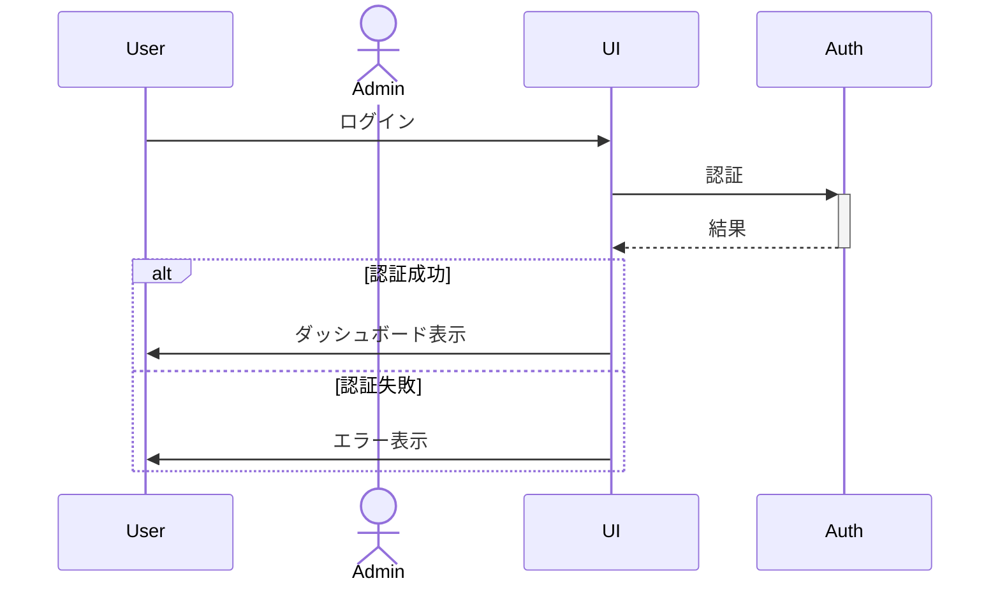

# NextDesign Mermaid Converter

Next Design シーケンス図と Mermaid 形式の完全双方向変換を実現する Next Design エクステンションです。

## 概要

このエクステンションは、Next Design のシーケンス図を Mermaid 形式にエクスポートしたり、Mermaid 形式のシーケンス図を Next Design にインポートする機能を提供します。メタデータファイルを使用することで、要素のIDや順序、カスタムフィールドを完全に保持した双方向変換が可能です。

## 📚 ドキュメント

- **[ユーザーガイド](docs/user-guide.md)** - インストール、使用方法、トラブルシューティング
- **[開発者ガイド](docs/developer-guide.md)** - アーキテクチャ、API、実装ガイド
- **[ファイル形式仕様](docs/file-format.md)** - Mermaid とメタデータの詳細仕様
- **[トラブルシューティング](docs/troubleshooting.md)** - よくある問題と解決方法

## 実装状況

### Phase 1: プロジェクト基盤 ✅ 完了
- ディレクトリ構造、README、ライセンス、エディタ設定

### Phase 2: コアフレームワーク ✅ 完了
- manifest.json、リボンタブ、コマンド定義、エントリーポイント

### Phase 3: 基本エクスポート ✅ 完了
- ライフライン（participant）のエクスポート
- メッセージ（同期 `->>）のエクスポート
- メタデータ JSON 生成
- ファイル出力（現在: 固定パス `C:\temp\`）

### Phase 4: 高度なエクスポート ⚠️ 未実装
- [ ] フラグメント（alt/loop/opt/par）
- [ ] アクティベーション（+/-）
- [ ] ノート（Note left/right/over）
- [ ] アクター（actor）
- [ ] 非同期メッセージ（-->>）
- [ ] ファイルダイアログ実装

### Phase 5: インポート完全実装 ⚠️ 未実装
- [ ] Mermaid 構文完全パース
- [ ] メタデータ自動検出
- [ ] Next Design モデル生成
- [ ] トランザクション管理
- [ ] エラーハンドリング

### Phase 6: 最終仕上げ ✅ 部分完了
- [x] ユーザーガイド
- [x] 開発者ガイド
- [x] ファイル形式仕様
- [x] トラブルシューティング
- [x] サンプルファイル（login_diagram、ecommerce_flow）
- [ ] 複雑なサンプル（ネストフラグメント）

## 主な機能

### ✅ エクスポート機能（Phase 3 完了）
- **基本要素**: ライフライン（participant）、メッセージ（同期 `->>`)
- **メタデータ保存**: 要素ID、順序を JSON ファイルに自動保存
- **エラーハンドリング**: 詳細ログ出力（Output ウィンドウ）

### ⚠️ 高度なエクスポート（Phase 4 予定）
- フラグメント（alt/loop/opt/par）、アクティベーション（+/-）、ノート
- アクター（actor）、非同期メッセージ（-->>）
- ファイルダイアログによる保存先選択

### ⚠️ インポート機能（Phase 5 予定）
- **完全パース**: Mermaid 構文の包括的な解析（ネストフラグメント対応）
- **メタデータ対応**: 既存要素のIDを維持した更新
- **新規ID割り当て**: メタデータなしでも自動的に新規要素を生成
- **トランザクション管理**: エラー時の自動ロールバック

## インストール

1. 最新の [Releases](../../releases) から `MermaidConverter.zip` をダウンロード
2. ZIP ファイルを任意のフォルダに解凍
3. Next Design を起動し、「ツール」→「オプション」→「エクステンション」を開く
4. 「追加」ボタンをクリックし、解凍したフォルダを選択
5. Next Design を再起動

## 使用方法

### エクスポート（Phase 3 実装済み）

1. Next Design でシーケンス図を選択
2. リボンタブ「Mermaid変換」→「Mermaidへエクスポート」をクリック
3. エクスポート完了後、以下のファイルが `C:\temp\` に生成されます：
   - `exported_diagram.mmd` - Mermaid 形式のシーケンス図
   - `exported_diagram.meta.json` - メタデータファイル（ID、順序）

**注意**: Phase 3 では固定パス `C:\temp\` に出力されます。Phase 4 でファイルダイアログを実装予定です。

### インポート（Phase 5 実装予定）

インポート機能は Phase 5 で実装予定です。

詳細は **[ユーザーガイド](docs/user-guide.md)** を参照してください。

## ファイル形式

### Mermaid ファイル（.mmd）

エクスポートされる `.mmd` ファイルは、GitHub や VS Code などの Markdown 対応エディタで即座にプレビューできるよう、Mermaid コードブロックで囲まれています:



### メタデータファイル（.meta.json）

```json
{
  "version": "1.0",
  "diagram": {
    "id": "diagram_guid",
    "name": "Login Sequence",
    "description": "ユーザーログインフロー"
  },
  "lifelines": [
    {
      "mermaidId": "User",
      "nextDesignId": "lifeline_guid_001",
      "name": "ユーザー",
      "type": "Participant",
      "order": 1
    }
  ],
  "messages": [
    {
      "mermaidSourceId": "User",
      "mermaidTargetId": "UI",
      "nextDesignId": "message_guid_001",
      "name": "ログイン",
      "messageSort": "Synchronous",
      "order": 1
    }
  ]
}
```

詳細は **[ファイル形式仕様](docs/file-format.md)** を参照してください。

## サンプル

- **[examples/login_diagram.mmd](examples/login_diagram.mmd)** - シンプルなログインフロー（4ライフライン、6メッセージ）
- **[examples/ecommerce_flow_diagram.mmd](examples/ecommerce_flow_diagram.mmd)** - 複雑なECサイトフロー（5ライフライン、26メッセージ）

## サポート要素

### Phase 3 完了

| 要素 | Next Design | Mermaid | サポート状況 |
|------|------------|---------|------------|
| ライフライン | ILifeline | participant | ✅ 完全サポート |
| 同期メッセージ | IMessage (Synchronous) | ->> | ✅ 完全サポート |
| メタデータ | - | .meta.json | ✅ 完全サポート |

### Phase 4 実装予定

| 要素 | Next Design | Mermaid | サポート状況 |
|------|------------|---------|------------|
| アクター | ILifeline (Actor) | actor | ⚠️ Phase 4 |
| 非同期メッセージ | IMessage (Asynchronous) | -->> | ⚠️ Phase 4 |
| 戻りメッセージ | IMessage (Return) | --) | ⚠️ Phase 4 |
| アクティベーション | - | +/- | ⚠️ Phase 4 |
| フラグメント | IInteractionFragment | alt/loop/opt/par | ⚠️ Phase 4 |
| ノート | - | Note | ⚠️ Phase 4 |

### 未サポート

| 要素 | Next Design | Mermaid | サポート状況 |
|------|------------|---------|------------|
| スタイリング | - | rect/背景色 | ❌ 未サポート |

## トラブルシューティング

詳細は **[トラブルシューティング](docs/troubleshooting.md)** を参照してください。

### よくある問題

**Q: リボンタブが表示されません**
- A: Next Design を再起動してください。それでも表示されない場合は、エクステンション設定を確認してください。

**Q: 「モデルが選択されていません」エラー**
- A: プロジェクトビューでシーケンス図を選択してください。

**Q: ファイルが出力されません**
- A: `C:\temp\` フォルダを作成してください。Phase 4 でファイルダイアログを実装予定です。

**Q: ライフラインが0個**
- A: 出力ウィンドウ（表示→出力）でエラーログを確認してください。Next Design のメタモデル定義が想定と異なる可能性があります。

## ライセンス

MIT License - 詳細は [LICENSE](LICENSE) を参照してください。

## バージョン履歴

### v0.3.0（Phase 3 完了 - 現在）
- 基本エクスポート機能（ライフライン + 同期メッセージ）
- メタデータ JSON 生成
- サンプルファイル（login_diagram、ecommerce_flow）
- 完全ドキュメント（ユーザーガイド、開発者ガイド、ファイル形式仕様、トラブルシューティング）

### v1.0.0（予定 - Phase 6 完了後）
- エクスポート機能（基本要素 + 高度な要素）
- インポート機能（完全パース + メタデータ対応）
- ファイルダイアログ実装
- 複雑なサンプル追加

## 作成者

NextDesign Mermaid Converter Development Team

## サポート

問題や要望がある場合は、[Issues](../../issues) でお知らせください。
