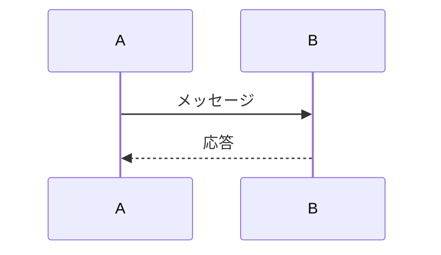
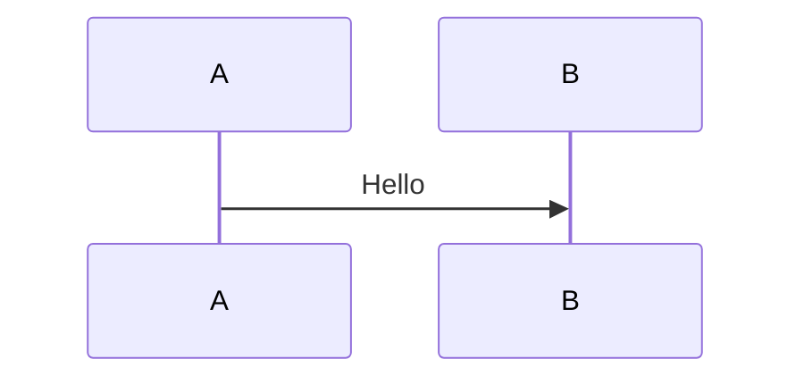

# ファイル形式仕様

NextDesign Mermaid Converterで使用されるファイル形式の仕様を説明します。

## 目次

1. [Mermaidファイル (.mmd)](#mermaidファイル-mmd)
2. [メタデータファイル (.meta.json)](#メタデータファイル-metajson)
3. [サポートするMermaid構文](#サポートするmermaid構文)
4. [拡張可能性](#拡張可能性)

## Mermaidファイル (.mmd)

### 基本構造



### エンコーディング

- **文字エンコーディング**: UTF-8 (BOM なし)
- **改行コード**: LF または CRLF (どちらでも可)
- **インデント**: スペース4つ推奨

### ヘッダー

必須:
```
sequenceDiagram
```

これがファイルの最初の行に必要です。

### コメント

Mermaidのコメント構文:
```
%% これはコメントです
```

## メタデータファイル (.meta.json)

### 概要

NextDesign固有の情報を保存するJSONファイル。

### 命名規則

Mermaidファイル名に基づく:
- Mermaidファイル: `example.mmd`
- メタデータファイル: `example.meta.json`

### 基本構造

```json
{
  "diagram": {
    "id": "string",
    "name": "string",
    "description": "string",
    "customData": {}
  },
  "lifelines": [
    {
      "id": "string",
      "name": "string",
      "mermaidId": "string",
      "order": "number",
      "typeModel": "string",
      "customData": {}
    }
  ],
  "messages": [
    {
      "id": "string",
      "name": "string",
      "sender": "string",
      "receiver": "string",
      "messageSort": "string",
      "order": "number",
      "customData": {}
    }
  ],
  "fragments": [
    {
      "id": "string",
      "type": "string",
      "condition": "string",
      "operands": [],
      "customData": {}
    }
  ]
}
```

### フィールド仕様

#### diagram (ダイアグラム情報)

| フィールド | 型 | 必須 | 説明 |
|-----------|-----|------|------|
| id | string | ✓ | NextDesignのダイアグラムID |
| name | string | ✓ | ダイアグラム名 |
| description | string |  | 説明 |
| customData | object |  | カスタムデータ |

#### lifelines (ライフライン情報)

| フィールド | 型 | 必須 | 説明 |
|-----------|-----|------|------|
| id | string | ✓ | NextDesignのライフラインID |
| name | string | ✓ | ライフライン名 |
| mermaidId | string | ✓ | Mermaid内で使用されるID |
| order | number | ✓ | 表示順序 (0から開始) |
| typeModel | string |  | マッピングされた型モデルのID |
| customData | object |  | カスタムデータ |

#### messages (メッセージ情報)

| フィールド | 型 | 必須 | 説明 |
|-----------|-----|------|------|
| id | string | ✓ | NextDesignのメッセージID |
| name | string | ✓ | メッセージテキスト |
| sender | string | ✓ | 送信元ライフライン名 |
| receiver | string | ✓ | 受信先ライフライン名 |
| kind | string | ✓ | メッセージ種別 |
| order | number | ✓ | 表示順序 (0から開始) |
| customData | object |  | カスタムデータ |

**kind の値:**
- `sync` - 同期呼び出し
- `async` - 非同期呼び出し
- `reply` - 応答
- `create` - オブジェクト生成
- `destroy` - オブジェクト破棄

#### fragments (フラグメント情報)

| フィールド | 型 | 必須 | 説明 |
|-----------|-----|------|------|
| id | string | ✓ | NextDesignのフラグメントID |
| type | string | ✓ | フラグメント種別 |
| condition | string |  | ガード条件 |
| operands | array |  | オペランド情報 |
| customData | object |  | カスタムデータ |

**type の値:**
- `alt` - 条件分岐
- `opt` - オプション
- `loop` - 繰り返し
- `par` - 並行処理

### 完全な例

```json
{
  "diagram": {
    "id": "diagram-12345",
    "name": "ログインシーケンス",
    "description": "ユーザー認証フロー",
    "customData": {
      "author": "開発者A",
      "version": "1.0",
      "lastModified": "2025-01-15T10:30:00Z"
    }
  },
  "lifelines": [
    {
      "id": "lifeline-001",
      "name": "User",
      "mermaidId": "User",
      "order": 0,
      "typeModel": "model-user-type",
      "customData": {
        "color": "#FF5733",
        "stereotype": "actor"
      }
    },
    {
      "id": "lifeline-002",
      "name": "AuthServer",
      "mermaidId": "AuthServer",
      "order": 1,
      "typeModel": "model-auth-server",
      "customData": {
        "host": "auth.example.com",
        "port": 443
      }
    }
  ],
  "messages": [
    {
      "id": "message-001",
      "name": "ログイン要求",
      "sender": "User",
      "receiver": "AuthServer",
      "kind": "sync",
      "order": 0,
      "customData": {
        "timeout": 5000,
        "retryCount": 3
      }
    },
    {
      "id": "message-002",
      "name": "トークン",
      "sender": "AuthServer",
      "receiver": "User",
      "kind": "reply",
      "order": 1,
      "customData": {
        "tokenType": "JWT",
        "expiresIn": 3600
      }
    }
  ],
  "fragments": [
    {
      "id": "fragment-001",
      "type": "alt",
      "condition": "認証成功",
      "operands": [
        {
          "condition": "認証成功",
          "messages": ["message-002"]
        },
        {
          "condition": "認証失敗",
          "messages": ["message-003"]
        }
      ],
      "customData": {}
    }
  ]
}
```

## サポートするMermaid構文

### 現在サポート中

#### 1. ライフライン定義

**Participant (通常のライフライン)**
```mermaid
participant A
participant B as "名前の表示"
```

**Actor (アクター型)**
```mermaid
actor User
actor Admin as "管理者"
```

#### 2. メッセージ

**同期メッセージ (実線矢印)**
```mermaid
A->>B: 同期呼び出し
```

**非同期メッセージ (破線矢印)**
```mermaid
A-)B: 非同期呼び出し
```

**応答メッセージ (破線戻り矢印)**
```mermaid
B-->>A: 応答
```

**Create (オブジェクト生成)**
```mermaid
A->>+B: 生成
```

**Destroy (オブジェクト破棄)**
```mermaid
A->>xB: 破棄
```

#### 3. アクティベーション (将来対応)

**明示的なアクティベーション**
```mermaid
activate A
A->>B: メッセージ
deactivate A
```

**インラインアクティベーション**
```mermaid
A->>+B: 開始
B-->>-A: 終了
```

### 将来サポート予定

#### 1. 複合フラグメント

**Alt (条件分岐)**
```mermaid
alt 条件1
    A->>B: パターン1
else 条件2
    A->>C: パターン2
end
```

**Opt (オプション)**
```mermaid
opt 条件
    A->>B: オプション処理
end
```

**Loop (繰り返し)**
```mermaid
loop 回数
    A->>B: 繰り返し処理
end
```

**Par (並行処理)**
```mermaid
par 並行1
    A->>B: 処理1
and 並行2
    A->>C: 処理2
end
```

#### 2. ノート

**左側のノート**
```mermaid
Note left of A: 左側の注釈
```

**右側のノート**
```mermaid
Note right of A: 右側の注釈
```

**複数ライフラインにまたがるノート**
```mermaid
Note over A,B: 複数にまたがる注釈
```

#### 3. ネストフラグメント

```mermaid
alt 外側の条件
    opt 内側の条件
        A->>B: ネストされた処理
    end
else
    loop 繰り返し
        A->>C: 別のネスト
    end
end
```

**ネストレベル**: 最大5レベルまでサポート予定

## 拡張可能性

### カスタムメタデータの追加

各エンティティに `customData` フィールドがあり、自由にデータを追加できます。

#### 例1: バージョン管理情報

```json
{
  "diagram": {
    "customData": {
      "version": "2.1.0",
      "createdAt": "2025-01-01T00:00:00Z",
      "modifiedAt": "2025-01-15T10:30:00Z",
      "author": "developer@example.com"
    }
  }
}
```

#### 例2: スタイル情報

```json
{
  "lifelines": [
    {
      "customData": {
        "color": "#FF5733",
        "backgroundColor": "#FFFFFF",
        "fontSize": 12,
        "iconUrl": "https://example.com/icon.png"
      }
    }
  ]
}
```

#### 例3: ビジネスロジック情報

```json
{
  "messages": [
    {
      "customData": {
        "timeout": 5000,
        "retryPolicy": {
          "maxRetries": 3,
          "backoffMs": 1000
        },
        "authentication": "OAuth2",
        "logging": true
      }
    }
  ]
}
```

### 新しいエンティティタイプの追加

メタデータJSONのトップレベルに新しいエンティティを追加できます。

```json
{
  "diagram": { ... },
  "lifelines": [ ... ],
  "messages": [ ... ],
  "fragments": [ ... ],
  "notes": [
    {
      "id": "note-001",
      "text": "重要な注釈",
      "position": "left",
      "target": "User",
      "customData": {}
    }
  ],
  "executionSpecifications": [
    {
      "id": "exec-001",
      "lifeline": "AuthServer",
      "start": 10,
      "end": 50,
      "customData": {}
    }
  ]
}
```

## バージョニング

### メタデータバージョン

将来の互換性のため、メタデータにバージョン情報を追加することを推奨します。

```json
{
  "_version": "1.0.0",
  "_schema": "https://example.com/schema/mermaid-metadata-v1.json",
  "diagram": { ... }
}
```

### 下位互換性

- バージョン1.0.0: 現在の仕様
- バージョン1.1.0: フラグメント、ノートのサポート追加
- バージョン2.0.0: 破壊的変更 (フィールド名変更など)

## 検証

### JSONスキーマ

メタデータファイルの検証用JSONスキーマ (将来提供予定):
```
https://example.com/schema/mermaid-metadata-v1.json
```

### バリデーション項目

1. **必須フィールドの存在**
   - diagram.id, diagram.name
   - lifelines[].id, lifelines[].name, lifelines[].mermaidId
   - messages[].id, messages[].sender, messages[].receiver

2. **参照整合性**
   - messages[].sender/receiverがlifelines[].nameに存在
   - fragments[].operands[].messagesがmessages[].idに存在

3. **データ型**
   - order: 非負整数
   - id: 非空文字列
   - messageSort: 有効な値

4. **一意性**
   - lifelines[].id: 一意
   - messages[].id: 一意
   - fragments[].id: 一意

## ファイル例

### 最小限の例

**minimal.mmd:**


**minimal.meta.json:**
```json
{
  "diagram": {
    "id": "d1",
    "name": "Minimal"
  },
  "lifelines": [
    {"id": "l1", "name": "A", "mermaidId": "A", "order": 0},
    {"id": "l2", "name": "B", "mermaidId": "B", "order": 1}
  ],
  "messages": [
    {
      "id": "m1",
      "name": "Hello",
      "sender": "A",
      "receiver": "B",
      "messageSort": "syncCall",
      "order": 0
    }
  ]
}
```

### 完全な例

[login_diagram.mmd](../examples/login_diagram.mmd) と [login_diagram.meta.json](../examples/login_diagram.meta.json) を参照してください。

## 関連ドキュメント

- [ユーザーガイド](user-guide.md)
- [開発者ガイド](developer-guide.md)
- [トラブルシューティング](troubleshooting.md)
- [Mermaid公式ドキュメント](https://mermaid.js.org/syntax/sequenceDiagram.html)
