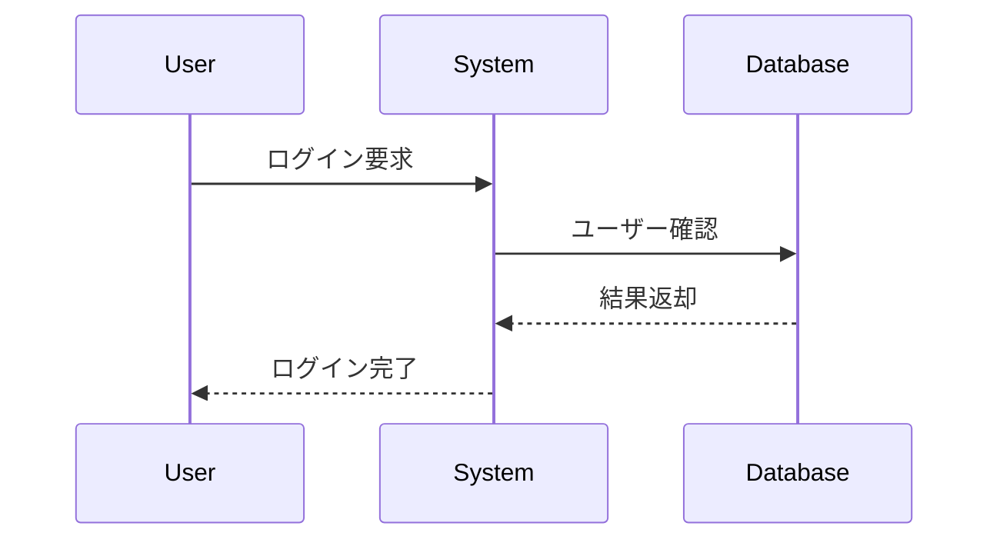

# ユーザーガイド

NextDesign Mermaid Converterの使用方法を説明します。

## 目次

1. [インストール](#インストール)
2. [エクスポート機能](#エクスポート機能)
3. [インポート機能](#インポート機能)
4. [検証機能](#検証機能)
5. [サポートする要素](#サポートする要素)
6. [よくある質問](#よくある質問)

## インストール

### 前提条件

- Next Design 3.0以降がインストールされていること
- Windows 10以降

### インストール手順

1. **エクステンションファイルの配置**
   ```
   %USERPROFILE%\Documents\NextDesign\Extensions\MermaidConverter\
   ```
   上記のフォルダに以下のファイルをコピーします:
   - `manifest.json`
   - `main.cs`
   - `resources/` (オプション: アイコンファイル)

2. **Next Designの再起動**
   - Next Designを完全に終了
   - Next Designを起動

3. **確認**
   - リボンタブに「Mermaid変換」が表示されることを確認

## エクスポート機能

NextDesignのシーケンス図をMermaid形式にエクスポートします。

### 使用手順

1. **シーケンス図を開く**
   - Next Designでシーケンス図を選択
   - エディタでシーケンス図を開く

2. **エクスポートを実行**
   - リボンタブ「Mermaid変換」→「Mermaidへエクスポート」をクリック
   - または、ショートカットキー (定義されている場合)

3. **保存先を指定**
   - ファイル保存ダイアログが表示されます
   - ファイル名を入力 (例: `login_diagram.mmd`)
   - 保存先フォルダを選択
   - 「保存」をクリック

4. **結果確認**
   - 完了ダイアログが表示されます
   - 以下のファイルが生成されます:
     - `{name}.mmd` - Mermaid形式のシーケンス図
     - `{name}.meta.json` - メタデータファイル

### エクスポートされる要素

#### 基本要素
- **ライフライン**: participant/actorとして出力
- **同期メッセージ**: `->>` 矢印
- **非同期メッセージ**: `-)` 矢印
- **応答メッセージ**: `-->>` 矢印

#### 高度な要素 (将来対応予定)
- **複合フラグメント**: alt/opt/loop/par
- **アクティベーション**: activate/deactivate
- **ノート**: Note left of/Note right of/Note over

### エクスポート例

**NextDesignのシーケンス図:**
- ライフライン: User, System, Database
- メッセージ: User -> System: ログイン要求
- メッセージ: System -> Database: ユーザー確認
- メッセージ: Database -> System: 結果返却
- メッセージ: System -> User: ログイン完了

**生成されるMermaidファイル (login.mmd):**


## インポート機能

Mermaid形式ファイルをNextDesignのシーケンス図としてインポートします。

### 使用手順

1. **プロジェクトを開く**
   - Next Designでプロジェクトを開く
   - インポート先のモデルを選択 (オプション)

2. **インポートを実行**
   - リボンタブ「Mermaid変換」→「Mermaidからインポート」をクリック

3. **ファイルを選択**
   - ファイル選択ダイアログが表示されます
   - `.mmd`ファイルを選択
   - 「開く」をクリック

4. **メタデータの自動検出**
   - 同じフォルダに`.meta.json`があれば自動的に読み込まれます
   - メタデータがない場合は新規作成されます

5. **結果確認**
   - 完了ダイアログが表示されます
   - シーケンス図がNext Designに作成されます

### メタデータについて

**メタデータファイル (.meta.json) とは:**
- NextDesign固有の情報を保存するJSONファイル
- エクスポート時に自動生成
- インポート時に自動検出

**メタデータに含まれる情報:**
- ダイアグラムID、名前、説明
- ライフラインのID、順序、マッピング情報
- メッセージのID、順序、種別
- カスタムプロパティ

**メタデータがない場合:**
- インポートは正常に実行されます
- 新しいIDが自動生成されます
- 順序はMermaidファイルの記述順になります

## 検証機能

Mermaidファイルの構文を検証します。

### 使用手順

1. **検証を実行**
   - リボンタブ「Mermaid変換」→「Mermaid検証」をクリック

2. **ファイルを選択**
   - 検証したい`.mmd`ファイルを選択

3. **結果確認**
   - 検証結果ダイアログが表示されます
   - エラーや警告がある場合は詳細が表示されます

### 検証項目

- `sequenceDiagram`ヘッダーの存在
- ライフライン定義の妥当性
- メッセージの送信元・受信先の存在
- 矢印構文の正確性
- フラグメントの対応 (end の有無)

## サポートする要素

### 現在サポート中

| 要素 | Mermaid構文 | 説明 |
|------|------------|------|
| ライフライン | `participant A` | 通常のライフライン |
| ライフライン (Actor) | `actor A` | アクター型ライフライン |
| 同期メッセージ | `A->>B: text` | 同期呼び出し |
| 非同期メッセージ | `A-)B: text` | 非同期呼び出し |
| 応答メッセージ | `B-->>A: text` | 戻り値 |
| Create | `A->>+B: text` | オブジェクト生成 |
| Destroy | `A->>xB: text` | オブジェクト破棄 |

### 将来サポート予定

| 要素 | Mermaid構文 | 説明 |
|------|------------|------|
| 複合フラグメント (alt) | `alt ... else ... end` | 条件分岐 |
| 複合フラグメント (opt) | `opt ... end` | オプション |
| 複合フラグメント (loop) | `loop ... end` | 繰り返し |
| 複合フラグメント (par) | `par ... and ... end` | 並行処理 |
| アクティベーション | `activate A` / `deactivate A` | 実行仕様 |
| ノート | `Note left of A: text` | 注釈 |

## よくある質問

### Q1: エクスポートしたファイルが開けません

**A:** 以下を確認してください:
- ファイル拡張子が`.mmd`になっているか
- UTF-8エンコーディングで保存されているか
- テキストエディタまたはMermaid対応ビューワーで開いているか

推奨ビューワー:
- VS Code + Mermaid拡張機能
- [Mermaid Live Editor](https://mermaid.live/)

### Q2: インポート時にエラーが発生します

**A:** 以下を確認してください:
- Next Designでプロジェクトが開かれているか
- Mermaidファイルの構文が正しいか (検証機能を使用)
- ライフラインが定義されているか
- メッセージの送信元・受信先がライフラインに存在するか

### Q3: メタデータファイルは必須ですか?

**A:** いいえ、必須ではありません。
- エクスポート時: 自動生成されます
- インポート時: なくてもインポート可能です (新規ID生成)
- メタデータがあると: ID・順序・カスタムプロパティが復元されます

### Q4: 日本語の名前は使えますか?

**A:** はい、使えます。
- ライフライン名、メッセージテキストともに日本語対応
- UTF-8エンコーディングで保存されます
- Mermaid ID としては英数字に変換される場合があります

### Q5: 既存のシーケンス図を上書きできますか?

**A:** 現在のバージョンでは新規作成のみです。
- インポート時は常に新しいシーケンス図が作成されます
- 既存のシーケンス図を更新する機能は将来対応予定です

### Q6: 複数のシーケンス図を一括変換できますか?

**A:** 現在のバージョンでは1つずつの変換のみです。
- 一括変換機能は将来対応予定です
- 現状はスクリプトやバッチ処理で対応してください

### Q7: エクスポート/インポート時のログはどこで確認できますか?

**A:** Next Designの出力ウィンドウで確認できます。
1. メニュー「表示」→「出力」
2. 出力チャンネル「mermaid-converter」を選択
3. 詳細なログが表示されます

## サポート

問題が解決しない場合:
1. [トラブルシューティングガイド](troubleshooting.md)を確認
2. [開発者ガイド](developer-guide.md)で技術詳細を確認
3. GitHubのIssuesで報告

## 関連ドキュメント

- [開発者ガイド](developer-guide.md)
- [ファイル形式仕様](file-format.md)
- [トラブルシューティング](troubleshooting.md)
