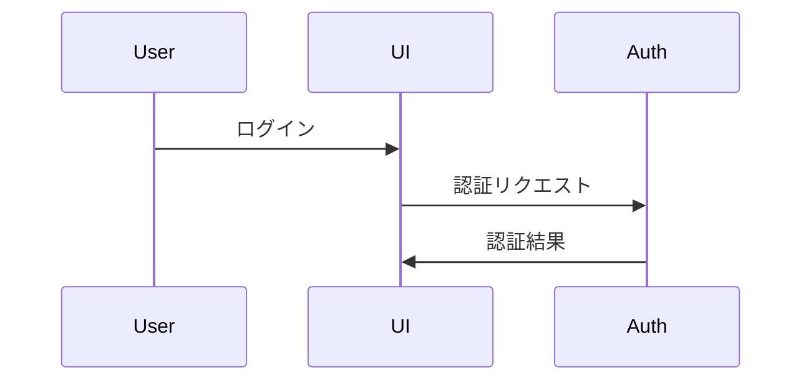

# NextDesign Mermaid Converter - ユーザーガイド

このガイドでは、NextDesign Mermaid Converter の使用方法を説明します。

## 目次

1. [インストール](#インストール)
2. [エクスポート](#エクスポート)
3. [インポート](#インポート)
4. [トラブルシューティング](#トラブルシューティング)

## インストール

### 前提条件

- Next Design がインストールされていること
- Windows OS

### インストール手順

1. 最新の `MermaidConverter.zip` をダウンロード
2. 任意のフォルダに解凍（例: `C:\Extensions\MermaidConverter`）
3. Next Design を起動
4. メニューバー「ツール」→「オプション」を選択
5. 左側のメニューから「エクステンション」を選択
6. 「追加」ボタンをクリック
7. 解凍したフォルダを選択
8. 「OK」をクリック
9. Next Design を再起動

### インストールの確認

Next Design 再起動後、リボンタブに「Mermaid変換」タブが表示されていれば成功です。

## エクスポート

Next Design のシーケンス図を Mermaid 形式にエクスポートします。

### エクスポート手順

#### Phase 2-3 現在の実装（基本機能）

現在の実装では、固定パス `C:\temp\` にファイルがエクスポートされます。

1. **シーケンス図を選択**
   - Next Design のプロジェクトビューでシーケンス図を選択

2. **エクスポートコマンド実行**
   - リボンタブ「Mermaid変換」→「Mermaidへエクスポート」をクリック

3. **結果確認**
   - エクスポート完了ダイアログが表示されます
   - `C:\temp\exported_diagram.mmd` - Mermaid ファイル
   - `C:\temp\exported_diagram.meta.json` - メタデータファイル

### エクスポートされる要素

現在の Phase 2-3 実装でサポートされる要素:

#### ✅ 完全サポート

- **ライフライン**
  - participant (通常のライフライン)
  - 名前、ID、順序がメタデータに保存されます

- **メッセージ**
  - 同期メッセージ (`->>`)
  - Source と Target のライフライン参照
  - メッセージ名、順序がメタデータに保存されます

#### ⚠️ Phase 4 で実装予定

- actor (アクター)
- 非同期メッセージ (`-->>`)
- 戻りメッセージ (`-->>`)
- Create/Destroy メッセージ
- アクティベーション (`+`/`-`)
- フラグメント (alt/loop/opt/par)
- ノート (Note)

### エクスポートファイルの例

#### Mermaid ファイル (`.mmd`)

エクスポートされるファイルは、Markdown対応エディタで即座にプレビューできるよう、Mermaidコードブロックで囲まれています:



#### メタデータファイル (`.meta.json`)

```json
{
  "version": "1.0",
  "diagram": {
    "name": "Login Sequence"
  },
  "lifelines": [
    {
      "mermaidId": "User",
      "nextDesignId": "guid-001",
      "name": "ユーザー",
      "type": "Participant",
      "order": 1
    }
  ],
  "messages": [
    {
      "mermaidSourceId": "User",
      "mermaidTargetId": "UI",
      "nextDesignId": "guid-101",
      "name": "ログイン",
      "messageSort": "Synchronous",
      "order": 1
    }
  ]
}
```

### メタデータファイルの役割

メタデータファイル (`.meta.json`) は、Next Design と Mermaid 間の対応関係を保持します:

1. **要素ID の保持**: Next Design の GUID と Mermaid ID の対応
2. **順序情報**: 要素の表示順序
3. **カスタムフィールド**: Next Design 固有のプロパティ（Phase 4+）
4. **双方向変換**: インポート時に既存要素を更新可能（Phase 5+）

## インポート

Mermaid 形式のシーケンス図を Next Design にインポートします。

### Phase 5 で実装予定

インポート機能は Phase 5 で実装予定です。以下の機能が含まれます:

- `.mmd` ファイルの完全パース
- メタデータ自動検出
- Next Design モデルの生成
- 既存要素の更新（メタデータがある場合）
- トランザクション管理

## トラブルシューティング

### エクスポートできない

#### 問題: 「モデルが選択されていません」エラー

**原因**: シーケンス図が選択されていない

**解決策**:
1. プロジェクトビューでシーケンス図を選択
2. エディタでシーケンス図を開いている場合は、プロジェクトビューで選択し直す

#### 問題: ファイルが生成されない

**原因**: `C:\temp\` フォルダが存在しない、または書き込み権限がない

**解決策**:
1. `C:\temp\` フォルダを手動で作成
2. または管理者権限で Next Design を実行

### エクスポート結果が不完全

#### 問題: ライフラインが0個

**原因**: Next Design のモデルがシーケンス図として認識されていない

**解決策**:
1. 出力ウィンドウ（表示 → 出力）でログを確認
2. モデルが `Lifelines` プロパティを持っているか確認
3. Next Design のメタモデル定義を確認

#### 問題: メッセージが0個

**原因**: 
- メッセージの Source または Target が null
- ライフラインマップに存在しないライフラインを参照

**解決策**:
1. 出力ウィンドウでエラーメッセージを確認
2. シーケンス図でメッセージの接続を確認
3. ライフラインとメッセージの関係を修正

### ログの確認方法

1. Next Design メニューバー「表示」→「出力」
2. 出力ウィンドウで `[MermaidConverter]` で始まるログを探す
3. エラーや警告メッセージを確認

### よくあるログメッセージ

```
[MermaidConverter] === Mermaid エクスポート開始 ===
[MermaidConverter] 選択されたモデル: MySequence
[MermaidConverter] シーケンス図: MySequence
[MermaidConverter] ライフライン数: 4
[MermaidConverter] メッセージ数: 6
```

正常なエクスポートの場合、このようなログが出力されます。

## 次のステップ

- Phase 4: [高度なエクスポート機能](developer-guide.md#phase-4)
- Phase 5: [完全なインポート機能](developer-guide.md#phase-5)
- Phase 6: [最終リリース](developer-guide.md#phase-6)

## フィードバック

問題や要望がある場合は、GitHub Issues でお知らせください。
